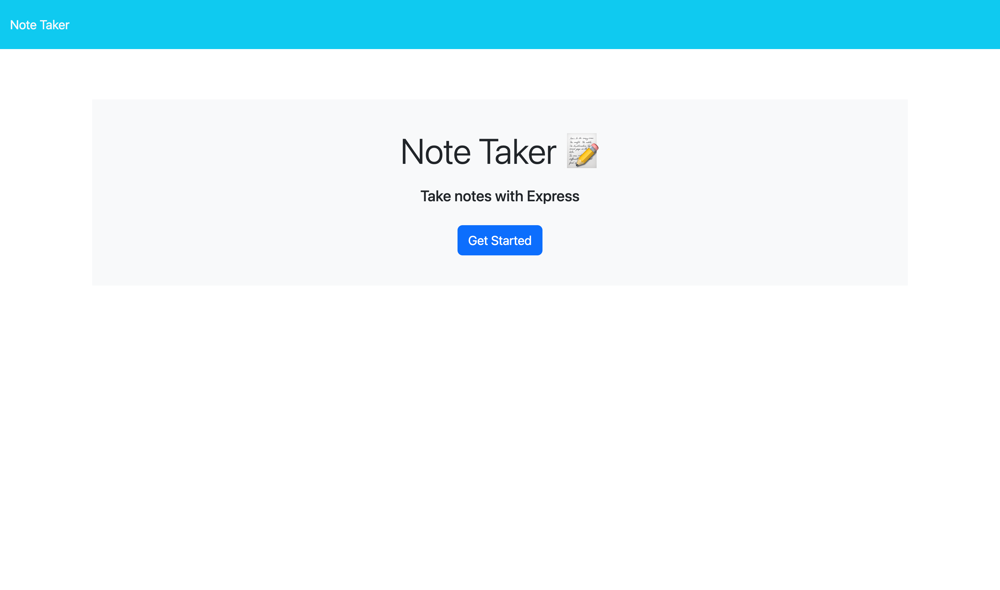
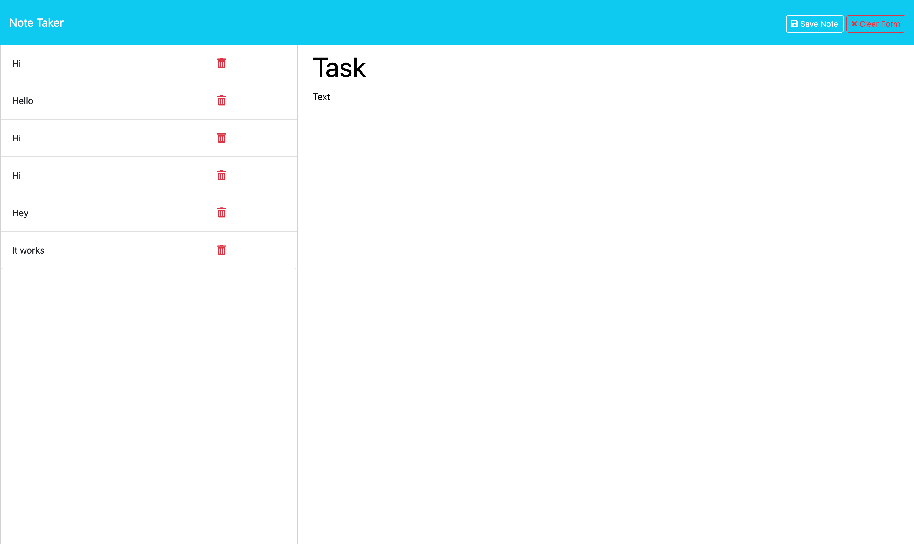

# Note-taker App

## Description

As a small business owner I want to create a note taker application that allows the user to write and save notes to better organize and keep track of tasks that need to be completed.

## Installation

The user needs to install the `express` dependencies to utilize this program.

## Usage

The user will be presented with a landing page, upon clicking the button to "Get Started" they will be sent to a page where they can assign a note a title and some text. After clicking the "Save Note" button the note will be saved and appear in a left aside. The user can keep making notes and also use the other buttons to "Clear Form" and create a "New Note." There is also a "trashcan" button that will delete the task.

## Links
[render-deployment](https://note-taker-app-t1di.onrender.com)

[github-repo](https://github.com/lllewell/note-taker-app)

